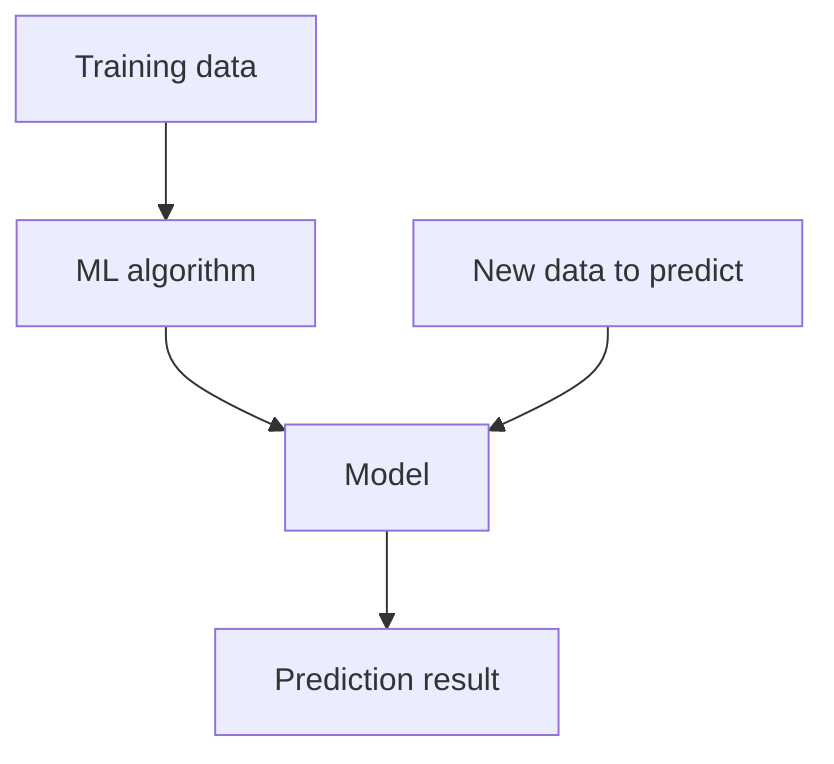

# neural-net

Es un modelo de aprendizaje automático, que busca emular el cerebro humano. Este modelo utiliza nodos organozados por capas (Entrada, ocultas y salida) con el fin de procesar datos, reconocer patrones complejos y tomar deciciones mediante ajuste sinapticos durante el entrenamiento.

## ¿Cómo funciona?

Transforma la informacióm que viaja desde la capa de entrada hasta la capa de salida.

### Capas de entrada

- Recibe los datos originales

### Capas ocultas

- Aplican operaciones matemáticas complejas a los datos para extraer caracteriscas y patrones.

### Capa de salida

- Devuelve el resultado final.

## Nota

- Para sacar el mayor provecho de ls redes neuronales estas deben ser entrenadas.
- La red debe comparar su predicción con el resultado correcto, ajusta ls conexiones (pesos) y minimiza el margen de error de las futura iteraciones.

## Principales tipos

### Redes neuronales convolucionales (CNN)

- Ideales para el procesamiento y analisis de imágenes y videos.

### Redes neuronales recurrentes (RNN)

- Diseñadas para manejar datos secuenciales, como el procesamiento de lenguaje natural o series temporales (Pronósticos)

### Redes neuronales profundas (Deep Learning)

- Son redes con múltiples capas ocultas que permiten abordar problemas extremadamente complejos como la traducción automática y los vehículos autónomos.

## ¿Donde se utilizan?

- Salud, finanzas, tecnología [...]

## Ecosistema principal

### Python Machine Learning & Deep Learning Libraries

| Tool / Library | Best For | Complexity | Learning Curve | Advantages | Typical Use Cases |
|---------------|-----------|------------|----------------|------------|-------------------|
| **NumPy** | Academic study and building models completely from scratch | High (Manual Math) | Steep | Fast numerical operations, efficient array handling, foundation of the Python scientific ecosystem | Implementing neural networks from scratch, matrix operations, linear algebra, data preprocessing |
| **Scikit-Learn** | Basic Multi-Layer Perceptrons (MLPs) alongside traditional Machine Learning algorithms | Low | Gentle | Simple API, extensive documentation, quick model training and evaluation | Classification, regression, clustering, feature engineering, introductory machine learning projects |
| **TensorFlow / Keras** | Industry production, deployment, and rapid prototyping | Medium | Moderate | Production-ready ecosystem, scalable deployment, GPU/TPU support, high-level APIs | Deep learning applications, NLP, image recognition, recommendation systems, enterprise AI solutions |
| **PyTorch** | Deep learning research, dynamic graph execution, and computer vision applications | Medium | Moderate | Flexible architecture, intuitive debugging, strong research community, excellent GPU support | Computer vision, large language models (LLMs), research projects, reinforcement learning, custom neural networks |

## Machine Learning (ML)

A common machine learning task is supervised learning, in which you have a dataset with inputs and known outputs. The task is to use this dataset to train a model that predicts the correct outputs based on the inputs. The image below presents the workflow to train a model using supervised learning

